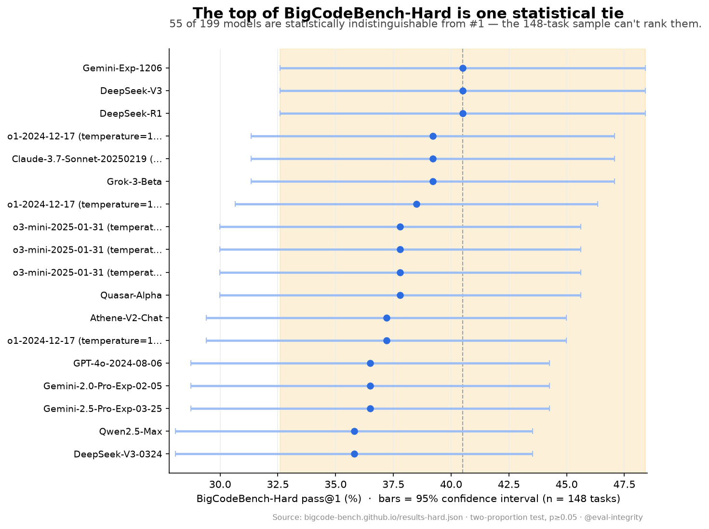

# Three ways leaderboards mislead you — and how to check

AI models are ranked, funded, and chosen on benchmark numbers: "94% on our eval," "beats GPT on this leaderboard," "#1 for coding." A surprising number of those numbers fail basic measurement controls that have nothing to do with how good the model is. Over the past week I audited several public leaderboards — recomputing everything from the raw data, no model inference, no budget. Here are three recurring ways a leaderboard misleads you, each with a real example you can reproduce, and — just as important — cases where the benchmark turned out to be perfectly fine.

## 1. The ranking is noise

A leaderboard prints a strict order. Whether that order is *real* depends on how many items the benchmark has. With few items, the gap between the top models is smaller than sampling noise — like a poll of 150 people reporting "Party A leads by 1 point."

The clearest example is **BigCodeBench-Hard**. It scores models on **148 tasks**, with pass rates near 40% — the region of maximum binomial variance. Run a two-proportion test of each model against the #1, and **55 of 199 models are statistically indistinguishable from the leader.** A quarter of the leaderboard is tied for first.

The same holds on **HumanEval+** (164 tasks): O1, GPT-4o, Claude 3.5, DeepSeek-V3 and Qwen2.5-Coder are all statistically tied — you can't say which is the "best coder" from that data. And across the **Open LLM Leaderboard v2**, whether the top is rankable tracks the sample size exactly: MMLU-PRO (12,032 items) separates a 1-point gap; IFEval (541–834) and MUSR (756) cannot resolve their tightly-packed tops. *(Filed: [BigCodeBench #121](https://github.com/bigcode-project/bigcodebench/issues/121).)*

**The fix:** report a significance tier or confidence interval alongside the rank — "#1 leads; ranks #2–#15 are tied."

## 2. The benchmark rewards the wrong thing

Sometimes the gold answer is systematically longer, shorter, or in a fixed position — so a content-blind heuristic scores well, and a model can climb by matching the artifact instead of the task.

On **RewardBench v1**, two subsets were length-degenerate: a zero-parameter "pick the longer answer" baseline scored **100%** — the correct answer was the longer one in every pair. **RewardBench 2** fixed this at the aggregate level (credit to the authors — a length ruler now scores *below* chance overall). But the fix inverted it on one subset: on `Focus`, "pick the *shortest*" scores **52.7%** (2.1× chance), and a causal control confirms it's length, not focus-quality — the lift vanishes when completions are matched for length. *(Filed: [reward-bench #267](https://github.com/allenai/reward-bench/issues/267), [#268](https://github.com/allenai/reward-bench/issues/268).)*

**The fix:** publish a length-controlled score, as AlpacaEval v2 did after its own length confound was quantified.

## 3. The same item is scored twice

Duplicate or overlapping items inflate weighting and quietly bias a per-category score. RewardBench 2 has 34 near-duplicate prompts (7 exact), including one that appears in *both* the Factuality and Focus subsets — so the categories aren't prompt-disjoint. Small, but real, and easy to miss.

## …and how to tell when a benchmark is actually fine

This is the part that matters for trust: **most well-made benchmarks pass.** I checked GSM8K for near-duplicates and test↔train leakage — clean. I checked MMLU-Pro for answer-position skew — the full 12,032-item pull is uniform (an earlier hunch, refuted by the data). I checked JudgeBench's construction for position and length bias — carefully balanced. A measurement audit that never returns "fine" isn't an audit; it's a hit piece. The point is to tell the two apart.

## The method

Every finding above is a two-line control run on public data: a two-proportion test for significance, a content-blind baseline for length/position/format confounds, a near-duplicate scan for contamination, a permutation/ablation for whether a claimed cause actually moves the number. Verdicts are derived from the numbers, not asserted — and a structural quirk only caps a claim at "unverified," never "artifact," without discriminating evidence.

If your team ships eval numbers that carry weight — a fundraise, a model-selection decision, a benchmark release — it's worth checking whether they'd survive this. Reports and details: **[github.com/ipezygj/eval-integrity](https://github.com/ipezygj/eval-integrity)**.
