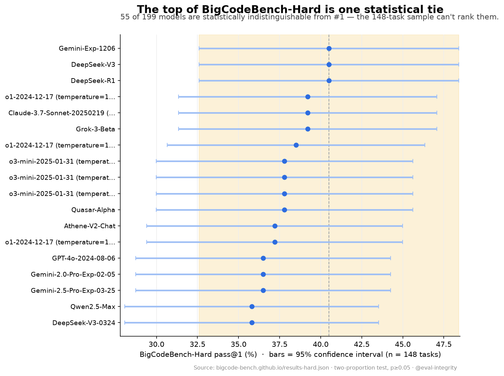

# Three ways leaderboards mislead you — and how to check

AI models are ranked, funded, and chosen on benchmark numbers: "94% on our eval," "beats GPT on this leaderboard," "#1 for coding." A surprising number of those numbers fail basic measurement controls that have nothing to do with how good the model is. Over the past week I audited several public leaderboards — recomputing everything from the raw data, no model inference, no budget. Here are three recurring ways a leaderboard misleads you, each with a real example you can reproduce, and — just as important — cases where the benchmark turned out to be perfectly fine.

## 1. The ranking is noise

A leaderboard prints a strict order. Whether that order is *real* depends on how many items the benchmark has. With few items, the gap between the top models is smaller than sampling noise — like a poll of 150 people reporting "Party A leads by 1 point."

The clearest example is **BigCodeBench-Hard**. It scores models on **148 tasks**, with pass rates near 40% — the region of maximum binomial variance. Run a two-proportion test of each model against the #1, and **55 of 199 models are statistically indistinguishable from the leader.** A quarter of the leaderboard is tied for first.

The same holds on **HumanEval+** (164 tasks): O1, GPT-4o, Claude 3.5, DeepSeek-V3 and Qwen2.5-Coder are all statistically tied — you can't say which is the "best coder" from that data. And across the **Open LLM Leaderboard v2**, whether the top is rankable tracks the sample size exactly: MMLU-PRO (12,032 items) separates a 1-point gap; MUSR (756) cannot resolve its tightly-packed top. IFEval does separate its leader (p = 0.037 at n = 834) and then flattens: the report has this right and an earlier version of this page had it backwards. *(Filed: [BigCodeBench #121](https://github.com/bigcode-project/bigcodebench/issues/121).)*

**The fix:** report a significance tier or confidence interval alongside the rank — "#1 leads; ranks #2–#15 are tied."

## 2. The benchmark rewards the wrong thing

Sometimes the gold answer is systematically longer, shorter, or in a fixed position — so a content-blind heuristic scores well, and a model can climb by matching the artifact instead of the task.

On **RewardBench v1**, two subsets were length-degenerate: a zero-parameter "pick the longer answer" baseline scored **100%** — the correct answer was the longer one in every pair. **RewardBench 2** fixed this at the aggregate level (credit to the authors — a length ruler now scores *below* chance overall). But the fix inverted it on one subset: on `Focus`, "pick the *shortest*" scores **52.7%** (2.1× chance), and a causal control confirms it's length, not focus-quality — the lift vanishes when completions are matched for length. *(Filed: [reward-bench #267](https://github.com/allenai/reward-bench/issues/267), [#268](https://github.com/allenai/reward-bench/issues/268).)*

**The fix:** publish a length-controlled score, as AlpacaEval v2 did after its own length confound was quantified.

## 3. The same item is scored twice

Duplicate or overlapping items inflate weighting and quietly bias a per-category score. RewardBench 2 has 34 near-duplicate prompts (7 exact), including one that appears in *both* the Factuality and Focus subsets — so the categories aren't prompt-disjoint. Small, but real, and easy to miss.

## …and how to tell when a benchmark is actually fine

This is the part that matters for trust: **most well-made benchmarks pass.** I checked GSM8K for near-duplicates and test↔train leakage — clean. I checked MMLU-Pro for answer-position skew — uniform across the 9,981 items that have all ten options (an earlier hunch, refuted by the data). Pooling all 12,032 makes the marginal look skewed only because 2,051 items have fewer than ten options; the earlier wording here claimed uniformity over the full pull, which is not what the data shows. I checked JudgeBench's construction for position and length bias — carefully balanced. A measurement audit that never returns "fine" isn't an audit; it's a hit piece. The point is to tell the two apart.

## The method

Every finding above is a two-line control run on public data: a two-proportion test for significance, a content-blind baseline for length/position/format confounds, a near-duplicate scan for contamination, a permutation/ablation for whether a claimed cause actually moves the number. Verdicts are derived from the numbers, not asserted — and a structural quirk only caps a claim at "unverified," never "artifact," without discriminating evidence.

If your team ships eval numbers that carry weight — a fundraise, a model-selection decision, a benchmark release — it's worth checking whether they'd survive this. Reports and details: **[github.com/ipezygj/eval-integrity](https://github.com/ipezygj/eval-integrity)**.

---

## Corrections, 18 September 2026

Every claim in these reports about an external source, and every number
describing a leaderboard's own ranking, was re-checked against the source. Fifteen
did not survive. Two of them are structural and are the reason this note leads
with them.

**The GPQA report audited the wrong models.** It named
`Daemontatox/Llama3.3-70B-CogniLink` as the GPQA leader with a 3.69pp lead. That
model ranks seventh of 4,576. The ranking had been taken from roughly the first
tenth of the dataset in its native order and never sorted against the whole. The
true top gap is 0.17pp at p = 0.93, so the conclusion is stronger than before,
but a named author's model was published as the board's best when it is not.

**The RewardBench report audited the wrong pairs, in all four categories.** The
models were hardcoded in the reproduce script rather than derived from the board.
Recomputed over all 151 models with complete coverage: Chat is led by
`sfairXC/FsfairX-LLaMA3-RM-v0.1`, Chat Hard and Reasoning by
`infly/INF-ORM-Llama3.1-70B`, Safety by `Skywork/Skywork-Reward-Gemma-2-27B-v0.2`,
and the overall board by INF-ORM rather than the Skywork model named here. On the
corrected pairs, three of the four categories are still not separable
(p = 1.000, 0.864, 0.568) but **Reasoning is** (p = 0.002), so "in any of the four
categories" was too strong. The issue filed on the RewardBench tracker has been
corrected in place.

The rest, in brief: the LiveCodeBench second tier has four models rather than five,
because the sixth sits just below the 0.05 threshold it was printed as meeting;
the MT-Bench report attributed to Zheng et al. a claim of order-invariance they
never make and in fact test and report failing, compared our 87.1% swap
consistency to their 65.0% as though the two agreed, put the phrase "LLM judges
reward length" in their mouths, and counted "blind leakage" among their documented
biases when it is our own probe; the RewardBench 2 report credited the authors
with deliberately correcting a length bias their paper never discusses, and said
they "rebuilt" subsets that do not exist in v2; the MBPP+ tie count is 6, not
about 10; the MUSR tie count is 8, not the top fifteen; one of the two reward
models quoted as exceeding 87% on three subsets reaches 76.1 and 82.0 on two of
them; the RewardBench headline is a weighted average of section scores, not a
pooled 2,985-item accuracy; and on this site the IFEval claim contradicted the
report it summarised, with the data on the report's side, while the MMLU-Pro
uniformity claim holds for the ten-option items rather than the full pull.

One thing about how this happened is worth recording. The GPQA error had already
been found and corrected on 17 September, on the published page version of that
audit. The correction never travelled to this report, to the repository, or to
the deposit, because nothing connects them but memory. A fix applied to one
surface is not a fix.

Nothing in the measurements changed. Every hash, every item count, every McNemar
and bootstrap that was recomputed came back identical.
